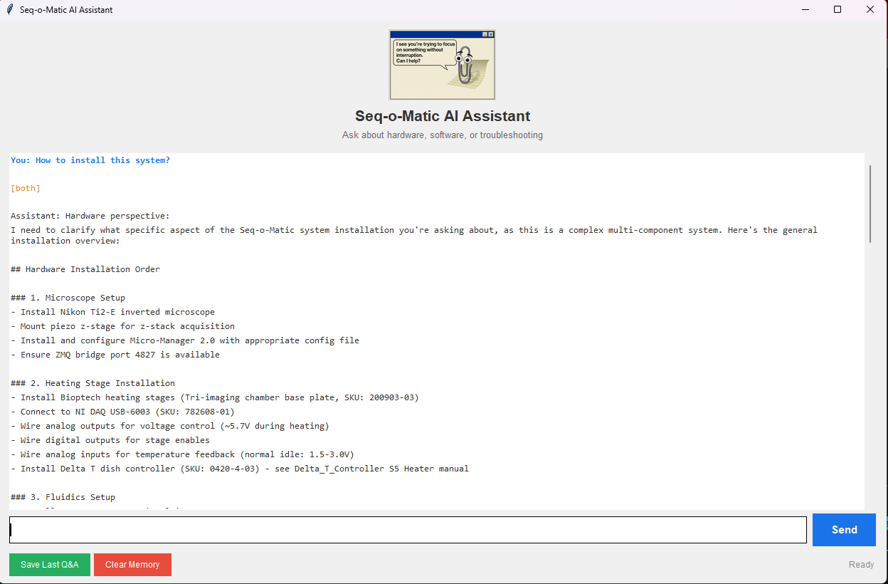

# Seq-o-Matic AI Agent

**AI-powered assistant for the Seq-o-Matic laboratory automation system.**
The laboratory automation system is published https://github.com/BarseqLab/Seq_o_matics. 
This intelligent agent that can answer questions about hardware, software, and troubleshooting -- and optionally control lab equipment via natural language.



---

## What This Does

Three modes of operation:

| Mode | Command | What it does |
|------|---------|-------------|
| **Chat (CLI)** | `python orchestrator.py` | Text Q&A in terminal |
| **Chat (GUI)** | `python chat_ui.py` | Visual chat window with logo |
| **Hardware Control** | `python hardware_control_agent.py` | Natural language control of pump, selector, heater |

The agent has two specialists:
- **Software Agent** -- knows the Seq-o-Matic codebase, architecture, config files
- **Hardware Agent** -- knows equipment manuals, parts catalog, troubleshooting procedures

An orchestrator automatically routes your question to the right specialist.

---

## Setup

### 1. Create the environment

```bash
cd E:\Seq_o_matics_agent
conda env create -f environment.yml
conda activate seq-o-matic-agent
```

### 2. Set your API key

Get a key from https://console.anthropic.com/settings/keys

```powershell
# PowerShell
$env:ANTHROPIC_API_KEY = "sk-ant-api03-your-key-here"

# Or set permanently via Windows Environment Variables
# (search "Environment Variables" in Start menu)
```

### 3. Build the knowledge bases

```bash
cd agent

# Index the codebase + docs (runs locally, free)
python index_knowledge.py

# Index hardware manuals + parts catalog
# (PDFs indexed locally free; TIF images need API key)
python index_hardware.py

# Test the search works (free, no API key needed)
python test_search.py
```

### 4. Run

```bash
# Option A: Terminal chat
python orchestrator.py

# Option B: GUI chat
python chat_ui.py

# Option C: Hardware control (connect to actual equipment)
python hardware_control_agent.py
```

---

## Project Structure

```
Seq_o_matics_agent/
  environment.yml                # Conda env: seq-o-matic-agent
  requirements.txt               # Pip fallback
  code/                          # Seq-o-Matic source code (for indexing + reference)
  docs/                          # Architecture, config, protocol docs
  agent/                         # AI agent code
    index_knowledge.py           # Index software knowledge -> ChromaDB
    index_hardware.py            # Index hardware manuals/parts -> ChromaDB
    test_search.py               # Test search quality (no API cost)
    agents.py                    # Software + Hardware specialist agents
    orchestrator.py              # Classifies questions, routes to specialists
    chat_ui.py                   # Tkinter GUI chat interface
    hardware_control_agent.py    # Natural language hardware control
    hardware_tools.py            # Tool definitions for pump/selector/heater
    vector_db/                   # ChromaDB database (auto-created)
    saved_qa/                    # Curated Q&A pairs (auto-created on save)
    hardware_knowledge/          # Hardware reference docs
      manuals/                   #   Equipment PDFs + system diagrams
      parts/                     #   Parts catalog with SKUs and vendors
        parts_catalog.json
      troubleshooting/           #   Common issues and solutions
        common_issues.md
```

---

## Commands During Chat

| Command | What it does |
|---------|-------------|
| Type a question | Ask about hardware or software |
| `save` | Save the last Q&A to knowledge base permanently |
| `clear` | Reset conversation memory |
| `quit` | Exit |

---

## Hardware Control Examples

```
You: Connect the pump and selector
  Planned actions (2):
    1. Connect to the Ismatec pump
    2. Connect to the fluid selectors
  Execute? (yes/no): yes

You: Pump 3ml of PBST
  Planned actions (1):
    1. Select PBST and pump 3.0 mL at 1.5 mL/min
  Execute? (yes/no): yes

You: Heat for 3 minutes
  Planned actions (1):
    1. Heat all stages for 180 seconds
  Execute? (yes/no): yes

You: Run bcseq01 protocol
  Planned actions (1):
    1. Run full protocol: bcseq01
  Execute? (yes/no): yes
```

Every hardware command shows what it will do and waits for confirmation before executing.

---

## Adding Knowledge

### Add a new manual
1. Drop the PDF into `agent/hardware_knowledge/manuals/`
2. Re-run `python index_hardware.py`

### Add a new part
1. Edit `agent/hardware_knowledge/parts/parts_catalog.json`
2. Re-run `python index_hardware.py`

### Save important Q&A
Type `save` after a good answer -- it gets permanently indexed into the knowledge base so future questions can find it.

---

## Cost

| Action | Cost |
|--------|------|
| Indexing code/docs/PDFs | Free (runs locally) |
| Indexing TIF images | ~$0.03 per image (one-time) |
| Each chat question | ~$0.01 - $0.05 |
| Hardware control command | ~$0.02 per command |
